# MeshyAI Integration - AI 3D Model Generator

## Overview

This feature integrates MeshyAI's Text-to-3D API into the Cesium Flight Simulator, allowing users to generate 3D models on-the-fly using natural language prompts.

**Architecture:** Frontend (React) + Lightweight Express proxy server to handle CORS issues.

## Features

✅ **Text-to-3D Generation** - Create 3D models from natural language descriptions
✅ **Real-time Progress Tracking** - Visual progress bars showing generation stages
✅ **Persistent Local Storage** - Models saved in IndexedDB for offline access
✅ **Model Inventory** - Browse, search, and manage generated models
✅ **Multiple Art Styles** - Realistic, sculpture, cartoon, low poly, voxel
✅ **PBR Material Support** - High-quality textures with metallic, roughness, normal maps
✅ **GLB Format** - Optimized for web and Cesium
✅ **Download Models** - Export models as .glb files
✅ **Favorites System** - Mark important models
✅ **Tags & Search** - Auto-tagging from prompts with full-text search

## Running the Application

The application consists of two servers that must run concurrently:

1. **Express API Server** (port 3001) - Proxies MeshyAI API requests and handles CORS
2. **Vite Dev Server** (port 5174) - Serves the React frontend

### Start Both Servers

From the root directory:

```bash
npm run dev
```

This will start both servers using `concurrently`:
- API Server: `http://localhost:3001`
- Web Server: `http://localhost:5174`

### Start Individually

**API Server only:**
```bash
npm run dev:api
# or
cd packages/api && npm run dev
```

**Web Server only:**
```bash
npm run dev:web
# or
cd packages/web && npm run dev
```

### Why the Proxy Server?

MeshyAI's asset download URLs don't include CORS headers, which blocks direct browser downloads. The Express proxy:
- Forwards API requests to MeshyAI
- Downloads GLB files server-side (no CORS)
- Streams them back to the browser

See `packages/api/README.md` for detailed proxy documentation.

## Getting Started

### 1. Get a MeshyAI API Key

1. Visit [meshy.ai](https://www.meshy.ai)
2. Sign up for a free account
3. Navigate to [meshy.ai/api](https://www.meshy.ai/api)
4. Create an API key
5. Copy your API key (starts with `msy_`)

### 2. Access the AI Model Generator

1. Launch the Cesium Flight Simulator
2. Click the **"AI Models"** button in the bottom-right corner
3. The overlay will open showing three tabs: Generator, Queue, Inventory

### 3. Enter Your API Key

1. In the **Generator** tab, you'll see an API key setup section
2. Paste your API key into the input field
3. Click **"Save Key"**
4. Your key is stored locally in `localStorage` (never sent to any server except MeshyAI)

**Test Mode:** For testing, you can use the dummy key provided: `msy_dummy_api_key_for_test_mode_12345678`

### 4. Generate Your First Model

1. In the prompt field, describe what you want:
   ```
   helicopter with dinosaur
   ```

2. Select an **Art Style**:
   - **Realistic** - Photorealistic models (5-8 minutes)
   - **Sculpture** - Sculptural style (2-3 minutes)
   - **Cartoon** - Cartoon style (3-5 minutes)
   - **Low Poly** - Low polygon count (1-2 minutes)
   - **Voxel** - Minecraft-like voxel art (1-2 minutes)

3. *(Optional)* Click **"Advanced Options"** for:
   - **Negative Prompt** - Things to avoid in the model
   - **Enable PBR Maps** - Generate metallic, roughness, normal maps
   - **Optimize Mesh** - Remesh for better topology

4. Click **"Generate Model 🚀"**

### 5. Track Progress

Switch to the **Queue** tab to see:
- Real-time progress (0-100%)
- Current stage: Preview → Refining → Downloading → Completed
- Thumbnail preview when available
- Any errors that occur

**Generation Stages:**
1. **Preview (0-40%)** - Generate base mesh geometry (~2-3 min)
2. **Refining (40-90%)** - Add textures and materials (~3-5 min)
3. **Downloading (90-100%)** - Download and save model (~10 sec)

### 6. View Your Models

Switch to the **Inventory** tab to:
- Browse all generated models in a grid view
- Search by prompt text or tags
- Filter by favorites
- See file size and creation date
- Download models as .glb files
- Delete models you don't need

## Architecture

```
packages/web/src/react/features/model-generator/
├── services/
│   ├── meshyApi.ts          # MeshyAI API client
│   ├── modelCache.ts        # IndexedDB storage service
│   └── types.ts             # TypeScript interfaces
├── hooks/
│   └── useModelGenerator.ts # Generation logic hook
├── components/
│   ├── ApiKeySetup.tsx           # API key management UI
│   ├── ModelGeneratorPanel.tsx   # Main generation UI
│   ├── GenerationQueue.tsx       # Active task queue
│   ├── ModelInventory.tsx        # Model browser
│   └── ModelGeneratorOverlay.tsx # Main overlay container
├── context/
│   └── GenerationContext.tsx     # Global state management
├── utils/
│   └── modelUtils.ts        # Utility functions
└── index.ts                 # Public exports
```

## API Flow

```mermaid
sequenceDiagram
    User->>UI: Enter prompt "helicopter with dinosaur"
    UI->>MeshyAPI: POST /text-to-3d (mode: preview)
    MeshyAPI-->>UI: taskId: "abc123"

    loop Poll every 5s
        UI->>MeshyAPI: GET /text-to-3d/abc123
        MeshyAPI-->>UI: {status: "IN_PROGRESS", progress: 45}
    end

    MeshyAPI-->>UI: {status: "SUCCEEDED", model_urls: {...}}

    UI->>MeshyAPI: POST /text-to-3d (mode: refine, previewTaskId: abc123)
    MeshyAPI-->>UI: taskId: "def456"

    loop Poll every 5s
        UI->>MeshyAPI: GET /text-to-3d/def456
        MeshyAPI-->>UI: {status: "IN_PROGRESS", progress: 67}
    end

    MeshyAPI-->>UI: {status: "SUCCEEDED", model_urls: {glb: "https://..."}}

    UI->>MeshyAPI: GET https://meshy-assets.../model.glb
    MeshyAPI-->>UI: ArrayBuffer (GLB file)

    UI->>IndexedDB: Save model
    IndexedDB-->>UI: Saved

    UI->>User: Model ready! ✅
```



## Code Examples

### Using the Generation Hook

```typescript
import { useModelGenerator } from './features/model-generator';

function MyComponent() {
  const { generateModel, isGenerating, error } = useModelGenerator();

  const handleGenerate = async () => {
    const model = await generateModel({
      prompt: 'futuristic spaceship',
      artStyle: 'realistic',
      negativePrompt: 'blurry, low quality',
      enablePbr: true,
      shouldRemesh: true,
    });

    if (model) {
      console.log('Generated model:', model);
    }
  };

  return (
    <button onClick={handleGenerate} disabled={isGenerating}>
      {isGenerating ? 'Generating...' : 'Generate Model'}
    </button>
  );
}
```

### Accessing the Context

```typescript
import { useGeneration } from './features/model-generator';

function MyComponent() {
  const {
    models,           // All generated models
    activeTasks,      // Currently generating tasks
    apiKey,           // User's API key
    isOverlayOpen,    // Overlay visibility
    setIsOverlayOpen  // Toggle overlay
  } = useGeneration();

  return (
    <div>
      <p>You have {models.length} models</p>
      <p>{activeTasks.length} models generating...</p>
      <button onClick={() => setIsOverlayOpen(true)}>
        Open Generator
      </button>
    </div>
  );
}
```

### Direct API Usage

```typescript
import { MeshyAPIService } from './services/meshyApi';

const api = new MeshyAPIService('your_api_key_here');

// Create preview
const previewTaskId = await api.createPreviewTask({
  prompt: 'cute robot',
  artStyle: 'cartoon',
});

// Wait for completion with progress callback
const previewResult = await api.waitForCompletion(
  previewTaskId,
  (progress) => console.log(`Preview: ${progress}%`)
);

// Create refine task
const refineTaskId = await api.createRefineTask({
  prompt: 'cute robot',
  previewTaskId,
  enablePbr: true,
});

// Wait for refine
const refineResult = await api.waitForCompletion(
  refineTaskId,
  (progress) => console.log(`Refine: ${progress}%`)
);

// Download model
const glbData = await api.downloadModel(refineResult.model_urls.glb);

// Now you have the ArrayBuffer containing the GLB file
```

## Storage

Models are stored locally using **IndexedDB** with the following structure:

```typescript
interface GeneratedModel {
  id: string;                    // Unique ID
  prompt: string;                // Original prompt
  artStyle: string;              // Art style used
  thumbnailUrl: string;          // Preview thumbnail
  modelUrl: string;              // Blob URL for model
  glbData: ArrayBuffer;          // Raw GLB file data
  metadata: {
    createdAt: Date;
    fileSize: number;            // Size in bytes
    previewTaskId: string;
    refineTaskId: string;
    credits: number;             // API credits used
  };
  tags: string[];                // Auto-extracted tags
  isFavorite: boolean;
}
```

**Storage Location:** `IndexedDB -> cesium-flight-sim-models -> models`

**Clear Storage:**
```javascript
// Open DevTools Console
const request = indexedDB.deleteDatabase('cesium-flight-sim-models');
```

## Cost Management

MeshyAI uses a credit system:

- **Preview Task**: 20 credits (Meshy-6) or 5 credits (other models)
- **Refine Task**: Additional credits (check MeshyAI pricing)

Each complete generation (preview + refine) costs **~20-40 credits** depending on settings.

**Tips to Save Credits:**
- Use test mode for development
- Preview-only mode for quick iterations
- Choose faster art styles (low poly, voxel) for testing
- Use realistic/high-quality only for final models

## Troubleshooting

### "API key not set"
**Solution:** Click "Edit" in the API key section and paste your MeshyAI API key.

### "API Error: 401 Unauthorized"
**Solution:** Your API key is invalid or expired. Get a new key from meshy.ai/api.

### "Task timeout - generation took too long"
**Solution:**
- The generation might be taking longer than expected
- Check your internet connection
- Try a simpler prompt or different art style
- Contact MeshyAI support if issue persists

### "Failed to download model"
**Solution:**
- Check your internet connection
- The model URL might have expired (rare)
- Try generating again

### Models not appearing in inventory
**Solution:**
- Check browser console for errors
- Clear IndexedDB and try again
- Make sure IndexedDB is enabled in your browser

### "Cannot find module 'react'"
**Solution:** Run `npm install` in the `packages/web` directory.

## Browser Compatibility

- ✅ Chrome/Edge (Recommended)
- ✅ Firefox
- ✅ Safari 14+
- ⚠️ Mobile browsers (UI optimized for desktop)

**Requirements:**
- IndexedDB support
- ES2020+ JavaScript
- Fetch API
- LocalStorage

## Security & Privacy

- ✅ API key stored in `localStorage` (client-side only)
- ✅ Models stored in IndexedDB (local only)
- ✅ No backend server required
- ✅ Direct API calls to MeshyAI only
- ⚠️ API key visible in DevTools (user's responsibility)
- ⚠️ API key sent in Authorization header to MeshyAI

**Best Practices:**
- Don't share your API key
- Use environment variables in production
- Implement key rotation if compromised
- Monitor credit usage on MeshyAI dashboard

## Future Enhancements

Planned features:
- [ ] Place models in Cesium scene
- [ ] Image-to-3D generation
- [ ] Text-to-Texture (re-texture existing models)
- [ ] Model variations
- [ ] Batch processing
- [ ] Community sharing
- [ ] Animation support (auto-rigging)
- [ ] Multiplayer sync
- [ ] AI-assisted prompts
- [ ] Style transfer

## Resources

- [MeshyAI Website](https://www.meshy.ai)
- [MeshyAI API Docs](https://docs.meshy.ai)
- [MeshyAI Pricing](https://www.meshy.ai/pricing)
- [Get API Key](https://www.meshy.ai/api)
- [Discord Community](https://discord.gg/meshyai) (check meshy.ai for link)

## Support

For issues related to:
- **MeshyAI API:** Contact MeshyAI support
- **Integration bugs:** Open an issue on GitHub
- **Feature requests:** Open a discussion on GitHub

## License

This integration follows the same license as the main project. MeshyAI API usage is subject to MeshyAI's terms of service.

---

**Happy Generating! 🎨✨**
